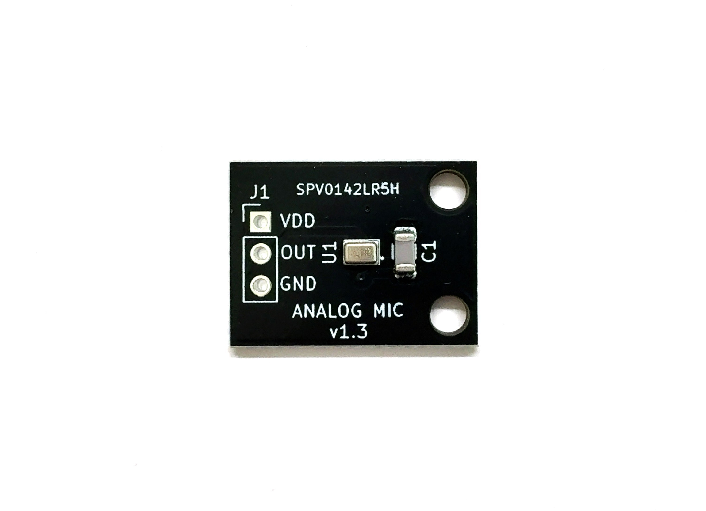
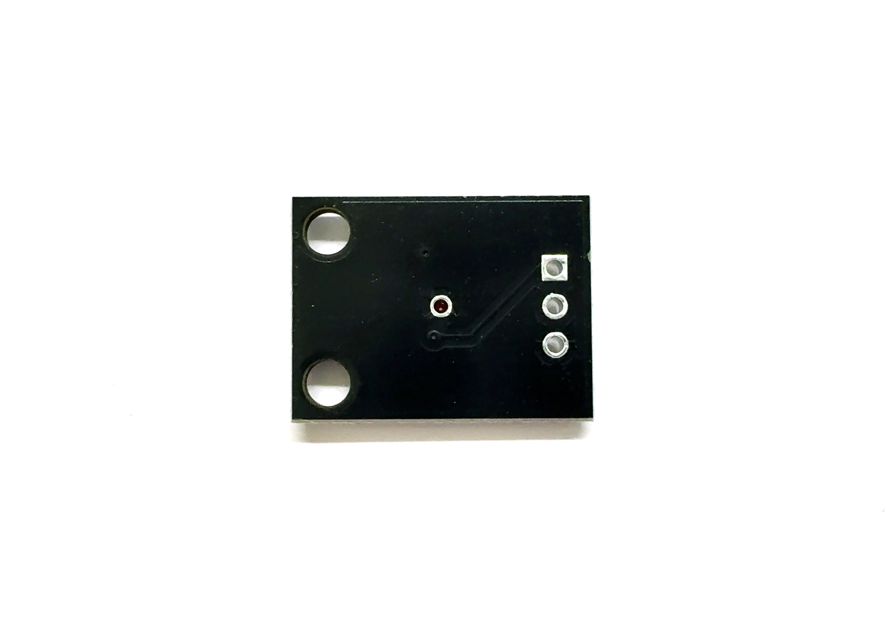

# アナログ出力マイク基板 SPV0142LR5H
The Converter board with SPV0142LR5H

## 概要
  * Syntiant社製の[アナログ出力MEMSマイクSPV0142LR5H][1]を2.54mmピッチへ変換する基板です。  
  * 可聴音から超音波(100Hz～80kHz)までの幅広い帯域を高感度にセンシングすることが可能です。  
  * 周波数特性が非常にフラットです(20Hz~10kHz±2dB、10kHz~80kHz±10dB)
  * 超音波センサや超音波通信などに使用可能です。  
  * マイク穴は基板裏面の丸印部分です。  
  * 電源電圧1.5V~3.6V
  * SPU0410LR5Hの後継品でフットプリントを除いて周波数特性や電気特性がほぼ同じです。

## 超音波マイク比較
 用途に応じて様々な製品をラインアップしています  
| 製品名 | 出力 | アンプ有無 | 用途 | 
|:-----------|:------------|:------------|:------------|
| [アナログ出力マイク(本製品)][A] | アナログ | 無 | 任意のアンプ回路を使用したい場合 | 
| [可変アンプ内蔵アナログ出力マイク][B] | アナログ | 有(可変1~50倍) | 増幅率の調整が必要な場合 |	
| [アンプ内蔵アナログ出力マイク][C] |	アナログ | 有(固定50倍) | 一定した増幅が必要な場合	| 
| [デジタル出力マイク][D] |	デジタルPDM | 不要 | フルデジタルで実装する場合やワイドレンジが必要な場合 | 

## 販売サイト
  * [スイッチサイエンス][2]

## 告知
SPU0410LR5Hの生産完了に伴い、後継品のSPV0142LR5Hに移行しました。

License - MIT

[1]: https://static1.squarespace.com/static/6488b0b8150a045d2d112999/t/67caf41d815fb04909623d2d/1741354016529/SPV0142LR5H-1-datasheet.pdf
[2]: https://www.switch-science.com/products/3378

[A]: https://github.com/meerstern/SPV0142LR5H
[B]: https://github.com/meerstern/SPV0142LR5H_with_VariableAmp
[C]: https://github.com/meerstern/SPV0142LR5H_with_Amp
[D]: https://github.com/meerstern/SPH0641LU
